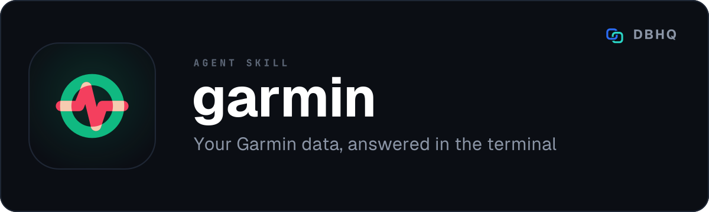

<div align="center">



# garmin

**Your Garmin data, in the conversation you are already having**

[](LICENSE)
[](https://code.claude.com/docs/en/plugins)
[]()

A free, open-source tool by [DBHQ](https://dbhq.uk) - documented at [skills.dbhq.uk](https://skills.dbhq.uk/garmin/)

</div>

---

Ask your agent how you slept and get an answer, rather than opening an app to read a number back to yourself. Body Battery, HRV, resting heart rate, stress, sleep stages, activities, VO2 max, training load, training status and training readiness - live, or archived to markdown you keep.

## What makes it different

**It answers and it archives.** Most integrations do one or the other. A live query returns today's vitals into the conversation; `garmin_snapshot.py` writes a whole day as a markdown file and `garmin_rollup.py` aggregates a week into a summary, both into a directory you name. Those files are yours, in plain text, and they outlive both this skill and your subscription.

**Your password is never stored, and your credentials never leave your machine.** The login asks for the password, hands it to Garmin and forgets it. `~/.dbhq/garmin/config.json` holds only your email and settings, at mode 600, the tokens Garmin issues are cached in `~/.dbhq/garmin/tokens/garmin_tokens.json` at mode 600, and the only host anything is sent to is Garmin's. There is no DBHQ service in the middle, no telemetry, and nothing to sign up for.

**"No data" and "the call failed" are different things, and it treats them differently.** A day Garmin has nothing for renders as "No data" and the file still writes. A fetch that actually failed - a rate limit, a rejected session, a network error - raises, the script exits non-zero, and nothing is written, so a file already archived for that day stays as it was. That distinction sounds pedantic until the alternative bites you: an archive quietly full of empty days, indistinguishable from days you genuinely did not wear the watch.

**It is tested against the real client, not only a mock.** Garmin Connect has no public API and no versioning; the library that wraps it renames things when Garmin moves underneath it. Mocked tests cannot see that, because a `MagicMock` invents whatever attribute it is asked for - which is how an auth-surface rename went unnoticed for months. So one test imports the real `garminconnect`, inspects its actual surface, and checks that the tokens the login writes are ones garminconnect's own login accepts. It still makes no network call.

## Install

### As a Claude Code plugin (recommended)

```
/plugin marketplace add dbhq-uk/marketplace
/plugin install garmin@dbhq
```

### Any agent (Cursor, Copilot, Windsurf, Gemini, Cline and more)

```bash
npx skills add dbhq-uk/garmin-skill
```

The [skills.sh](https://skills.sh) CLI installs into whichever agent directories
it finds, so this works outside Claude Code and Codex too.

### Local install (Claude Code or Codex)

```bash
git clone https://github.com/dbhq-uk/garmin-skill.git
cd garmin-skill
./install.sh          # Claude Code: symlinks into ~/.claude/skills (edits are live)
./install-codex.sh    # Codex: installs into ~/.codex/skills
```

[`install.sh`](install.sh) and [`install-codex.sh`](install-codex.sh) are the
same install two ways: Claude Code substitutes `${CLAUDE_SKILL_DIR}`, so the
whole skill directory is symlinked untouched, while Codex does not, so its
`SKILL.md` is rewritten at install time. Re-run the Codex one after editing
`SKILL.md`.

### Requirements

- **Python 3.12+.** That floor is `garminconnect`'s, not ours: version 0.3.x declares `Requires-Python >=3.12`, so pip cannot resolve the pinned dependency below it. `install.sh` builds a virtualenv inside the skill directory, which is what makes the same path correct under a Claude install and a Codex one
- A Garmin Connect account - the same one you use in the app

Manual, step-by-step setup is in [`skills/garmin/references/setup.md`](skills/garmin/references/setup.md) for when the script fails part-way.

### Logging in

You log in once, in your own terminal, with `scripts/garmin_login.py`, which
asks for your password and does not save it; every other script resumes from
the tokens that login saves and never logs in itself. If your account has
multi-factor authentication, Garmin sends a code by email or text when the
login starts and the script asks for it at the prompt. You only log in again
if the tokens stop working. `scripts/garmin_status.py` tells you whether they
are there and usable, without calling Garmin.

## Usage

Ask in any session.

```
"what's my body battery?"
"how did I sleep last night?"
"show my training status"
"garmin vitals for the week"
"what did I do in the last 30 days?"
"snapshot today to ./health/garmin"
```

| What you get | Command behind it |
|---|---|
| Resting HR, HRV, Body Battery, stress, steps, calories | `garmin_health.py today` / `yesterday` / a date |
| Seven-day table with averages, fetched a day at a time with a short pause | `garmin_health.py week` |
| Sleep score, duration, deep/light/REM/awake | `garmin_sleep.py` |
| Activities with HR, calories, training effect | `garmin_activities.py 7` |
| VO2 max, training load, readiness, status | `garmin_activities.py training` |
| A day as markdown | `garmin_snapshot.py --output-dir <dir>` |
| A week as markdown | `garmin_rollup.py --output-dir <dir>` |
| Whether it is set up, and what to do if not, with no call to Garmin | `garmin_status.py` |

The full command reference is in [`skills/garmin/SKILL.md`](skills/garmin/SKILL.md).

## What this will not do

**Write anything back to Garmin.** Every call is a read. The skill has no code path that creates, edits or deletes anything in your Garmin account, and it never will - a health record you did not enter yourself is worse than no record.

**Send your data anywhere but Garmin and you.** No analytics, no aggregation service, no "anonymised" upload. If you run it with the network off it fails to reach Garmin and does nothing else.

**Give you medical advice.** It reports what the watch measured. Garmin's own figures are estimates from a wrist optical sensor, and Body Battery, stress and sleep staging in particular are proprietary models rather than measurements. Treat them as trend lines, not diagnoses.

## Development

Want to hack on the skill or run it from source with live edits? See [`docs/dev-setup.md`](docs/dev-setup.md).

[`CONTRIBUTING.md`](CONTRIBUTING.md) covers working on it, and [`AGENTS.md`](AGENTS.md) is for an AI agent doing so. The skill itself is [`skills/garmin/SKILL.md`](skills/garmin/SKILL.md).

## Acknowledgements

Built on [`garminconnect`](https://github.com/cyberjunky/python-garminconnect) by cyberjunky, which does the genuinely hard part: keeping up with an API Garmin does not document. Earlier versions also relied on [`garth`](https://github.com/matin/garth) by Matin Tamizi, which garminconnect replaced with its own login in 0.3.

## Also from DBHQ

Every DBHQ agent skill is free, open source and installable from the same
marketplace, and all of them are documented at
**[skills.dbhq.uk](https://skills.dbhq.uk)**. The marketplace itself is
[dbhq-uk/marketplace](https://github.com/dbhq-uk/marketplace) - one
`/plugin marketplace add` and every one of them is available.

| Skill | What it does |
|---|---|
| [outlook](https://skills.dbhq.uk/outlook/) | Microsoft 365 mail and calendar, from the terminal |
| [trello](https://skills.dbhq.uk/trello/) | Your boards, run from your agent |
| [legwork](https://skills.dbhq.uk/legwork/) | Research that settles a decision, and says when it cannot |
| [dovetail](https://skills.dbhq.uk/dovetail/) | Checks whether your repository still agrees with itself |
| [verve](https://skills.dbhq.uk/verve/) | Strips AI tells from prose and puts a voice back |
| [vela](https://skills.dbhq.uk/vela/) | Compiler-exact code search, in any language you index |
| [imager](https://skills.dbhq.uk/imager/) | Images from GPT Image 2, costed before it spends |
| [gitview](https://skills.dbhq.uk/gitview/) | Which branches are finished, and safe to delete |
| [atlassian](https://skills.dbhq.uk/atlassian/) | Jira issues and Confluence pages |
| [pennyblack](https://skills.dbhq.uk/pennyblack/) | A physical letter, posted from the terminal |
| [buildwork](https://skills.dbhq.uk/buildwork/) | Your open issues, run as parallel agents |
| [deskwork](https://skills.dbhq.uk/deskwork/) | What an agent noticed, tracked as real work |
| [groupwork](https://skills.dbhq.uk/groupwork/) | A second agent on the work, adversary or partner |
| [headwork](https://skills.dbhq.uk/headwork/) | One decision at a time, with a recommendation |

Plus [heliograph](https://skills.dbhq.uk/heliograph/), for a machine you cannot log into.

## Licence

[MIT](LICENSE) © 2026 DBHQ Consulting Ltd
